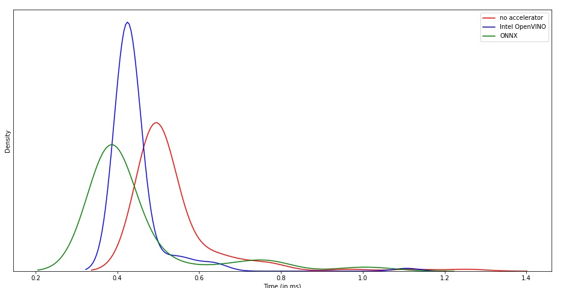

# zeroxQA : Few shot learning for QA tasks

A simple QA task here is defined as a Comprehensive reading task. Where a paragraph is given containing information about a domain. Along with it A question is given which can be answered using the paragraph and the supervision of starting and ending indexes in the paragraph corresponding for that question. A state of the art approach for such a problem is employing a transformer while masking the question and using two classification heads on top of the transformers for predicting start and stop indicies.


The major constrains and challenges we faced are below:
- To have model with very low inference time.
- To Generalize model over extremely unrelated domains.

Hence we employ a Meta Learning based training framework for training a shallow transformer model to generalize in outdomain queries while still offering faster convergence on outdomain targets.


Hence the above is the proposed framework along with [Bert-Mini-5](https://huggingface.co/mrm8488/bert-mini-5-finetuned-squadv2). For individual domains the meta model is later fine tuned for inference.

## Usage

### Preparing Dataset

```bash
$ python preprocess_csv_theme.py --data-csv=train_data.csv
$ python synthetic_gen.py --input_dir=datasets/train_data.csv --ner_limit=2 --use_qa_data=sample_question_answers.csv
```
This preprocesses the whole dataset into different shards of datasets for different domains. Then synthetically generates question and answer pairs for unannoted paragraphs for improving indomain queries.

<h3> Training </h3>

```bash
$ python meta_train.py --run-name meta_baseline --do-train --lr=1e-4 --meta-lr=5e-3 --meta-epochs=10000
$ python finetune.py
```

The First command trains a meta model using MAML for the in domain targets and the code is parallized for training individual models on individual in domain set. The second command fine tunes the meta model on a outdomain query using synthetically generated dataset using the paragraphs for the outdomain queries.


### Quantization
we performed model quantization and graph optimization using ONNX to compare the runtime optimization on two models namely small-Electra and mini5-BERT as shown in the figure.Using ONNX runtime optimizations, mini5-BERT only took 120 milliseconds and small-Electra took only 140 milliseconds. We observed that mini5-BERT offered us the best tradeoff between speed and accuracy. 

#### Model Quantization
- Converts 32-bit floating point tensors and operations in the model to 8-bit integer values. 
- A quantized model executes some/all of operations on tensors with reduced precision rather than full precision 32-bit floating point values. 
- Allows for a compact model representation and the use of high performance vectorized operations.
- We used ORTQuantizer module of ONNX(Open Neural Network eXchange) module of Optimum Library.

#### Graph Optimization
- Semantics-preserving graph rewrites which remove redundant nodes and redundant computation by pruning the computational graph of the model. 
- These opimizations also include fusion of nodes and constant folding.

## Results

One can observe the improvement due to meta learnt model on outdomain queries.


The Improvement for quantizing the model can be observed with the the distribution of average inference time for different settings.



